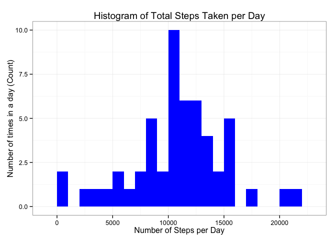
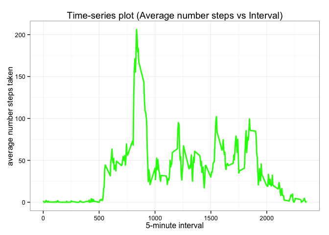
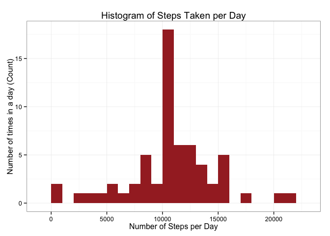
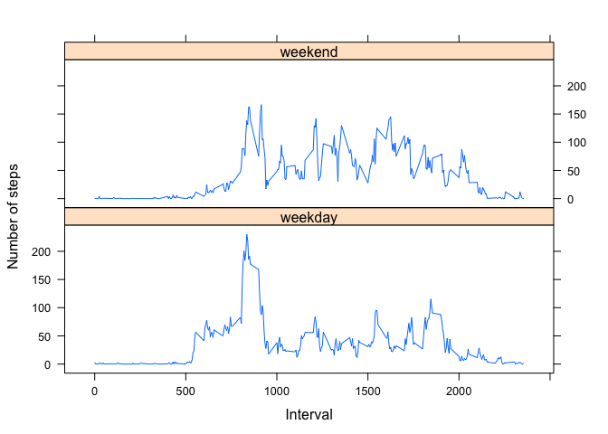

# Reproducible Research: Peer Assessment 1
Created by: LiChung Huang

## Loading required library packages

```r
library(dplyr)
```

```
## 
## Attaching package: 'dplyr'
## 
## The following object is masked from 'package:stats':
## 
##     filter
## 
## The following objects are masked from 'package:base':
## 
##     intersect, setdiff, setequal, union
```

```r
library(ggplot2)
library(lattice)

# Define some options for knitr path to output charts
knitr::opts_chunk$set(tidy=FALSE, fig.path='figure/')
```

## Loading and preprocessing the data

Read "activity.csv" records into "actData"

```r
actData <- read.csv("activity.csv", sep=",", header = TRUE, stringsAsFactors=FALSE, na.strings="NA")
```

Perform check on the structure of "actData"

```r
str(actData)
```

```
## 'data.frame':	17568 obs. of  3 variables:
##  $ steps   : int  NA NA NA NA NA NA NA NA NA NA ...
##  $ date    : chr  "2012-10-01" "2012-10-01" "2012-10-01" "2012-10-01" ...
##  $ interval: int  0 5 10 15 20 25 30 35 40 45 ...
```


```r
# Reformt data type for date and interval columns to prepare for grouping
actData$interval <- as.numeric(actData$interval)
actData$date <- as.Date(actData$date, format = "%Y-%m-%d")
```

## What is mean total number of steps taken per day?
(1) Calculate the total number of steps taken per day ?

To plot a histogram for the total number of steps per day,I summarise to calculate by grouping the total number of steps for each day.

```r
# Remove NA values and group by day for total number of steps 
perDaySteps <-
      na.omit(actData) %>% 
      select(steps, date, interval) %>% 
	    group_by(date) %>%
	    summarize(totSteps = sum(steps))
```


```r
# Plot histogram for number of steps per day
ggplot(perDaySteps, aes(x = totSteps)) + 
      geom_histogram(fill = "blue", binwidth = 1000) + 
      labs(x = "Number of Steps per Day", y = "Number of times in a day (Count)", 
          title="Histogram of Total Steps Taken per Day") + 
      theme_bw()
```

 

(2) Calculate and report the mean and median of the total number of steps taken per day.

```r
perDaySteps_mean <- mean(perDaySteps$totSteps, na.rm=TRUE)
```
The mean of the total number of steps per day is:

```r
print(perDaySteps_mean)
```

```
## [1] 10766.19
```


```r
perDaySteps_median <- median(perDaySteps$totSteps, na.rm=TRUE)
```
The median the total number of steps per day is:

```r
print(perDaySteps_median)
```

```
## [1] 10765
```


## What is the average daily activity pattern?

(1) Make a time series plot (i.e. type = "l") of the 5-minute interval (x-axis) and the average number of steps taken, averaged across all days (y-axis).


```r
# Calculate mean for number of steps taken for each day
intervGrpSteps <- aggregate(data=actData, steps~interval, FUN=mean, na.rm=TRUE)
colnames(intervGrpSteps) <- c("interval", "avgStepsByDay")

# Plot a Time-Series chart without using lattice plot
ggplot(intervGrpSteps, aes(x=interval, y=avgStepsByDay)) +   
        geom_line(color="green", size=1) +  
        labs(title="Time-series plot (Average number steps vs Interval)", 
             x="5-minute interval", 
             y="average number steps taken") +  
        theme_bw()
```

 

(2) Which 5-minute interval, on average across all the days in the dataset, contains the maximum number of steps?


```r
maxIntervSteps <- intervGrpSteps[which.max(intervGrpSteps$avgStepsByDay), "interval"]
```
The 5-minute interval timing, average across all the days with maximum number of steps is:

```r
print(maxIntervSteps)
```

```
## [1] 835
```

## Imputing missing values

Note that there are a number of days/intervals where there are missing values (coded as NA ). The presence of missing days may introduce bias into some calculations or summaries of the data.

(1) Calculate and report the total number of missing values in the dataset (i.e. the total number of rows with NA s)

```r
# Sum total row count for "steps" column with NA value
totMisVal <- sum(is.na(actData$steps))
```
The total number of missing values in the dataset is:

```r
print(totMisVal)
```

```
## [1] 2304
```

(2) Devise a strategy for filling in all of the missing values in the dataset. The strategy does not need to be sophisticated. For example, you could use the mean/median for that day, or the mean for that 5- minute interval, etc.

The strategy I adopt is to fill up the missing values (NA) using the mean value of each day.


```r
# Populate missing values in dataset
stepNewValues <- data.frame(actData$steps)
stepNewValues[is.na(stepNewValues),] <- ceiling(tapply(X=actData$steps,
                                                        INDEX=actData$interval,
                                                        FUN=mean,
                                                        na.rm=TRUE))
# Combine populated values of column 1 (steps) with original data column 2 and 3
stepsNewData <- cbind(stepNewValues, actData[,2:3])
colnames(stepsNewData) <- c("steps", "date", "interval")

# Sample top 15 rows
print(stepsNewData[1:15,])
```

```
##    steps       date interval
## 1      2 2012-10-01        0
## 2      1 2012-10-01        5
## 3      1 2012-10-01       10
## 4      1 2012-10-01       15
## 5      1 2012-10-01       20
## 6      3 2012-10-01       25
## 7      1 2012-10-01       30
## 8      1 2012-10-01       35
## 9      0 2012-10-01       40
## 10     2 2012-10-01       45
## 11     1 2012-10-01       50
## 12     1 2012-10-01       55
## 13     1 2012-10-01      100
## 14     1 2012-10-01      105
## 15     1 2012-10-01      110
```

(3) Create a new dataset that is equal to the original dataset but with the missing data filled in.

```r
# Group by day for total number of steps for new dataset
perDayStepsNewData <-
      stepsNewData %>% 
      select(steps, date, interval) %>% 
      group_by(date) %>%
      summarize(totNewSteps = sum(steps))
```

(4) Make a histogram of the total number of steps taken each day and Calculate and report the mean and median total number of steps taken per day. Do these values differ from the estimates from the first part of the assignment? What is the impact of imputing missing data on the estimates of the total daily number of steps?


```r
# Plot histogram for new number of steps per day
ggplot(perDayStepsNewData, aes(x = totNewSteps)) + 
      geom_histogram(fill = "brown", binwidth = 1000) + 
      labs(x = "Number of Steps per Day", y = "Number of times in a day (Count)", 
          title="Histogram of Steps Taken per Day") + 
      theme_bw()
```

 


```r
perDayStepsNewData_mean <- mean(perDayStepsNewData$totNewSteps)
```
The mean of the new total number of steps per day is:

```r
print(perDayStepsNewData_mean)
```

```
## [1] 10784.92
```
The new mean result is just slightly higher than the original mean value above.


```r
perDayStepsNewData_median <- median(perDayStepsNewData$totNewSteps)
```
The median the new total number of steps per day is: 

```r
print(perDayStepsNewData_median)
```

```
## [1] 10909
```
The new median result is higher than the original median value above.

Hence the impact is minimal after including mean values into NA rows for 'steps' column.

## Are there differences in activity patterns between weekdays and weekends?
For this part the weekdays() function may be of some help here. Use the dataset with the filled-in missing values for this part.

(1) Create a new factor variable in the dataset with two levels – “weekday” and “weekend” indicating whether a given date is a weekday or weekend day.


```r
#Create factor variable for "weekday" and "weekend"
stepsNewData$partWeek <- as.factor(ifelse(weekdays(stepsNewData$date) %in% c("Saturday","Sunday"), "weekend", "weekday")) 
```

(2) Make a panel plot containing a time series plot (i.e. type = "l" ) of the 5-minute interval (x-axis) and the average number of steps taken, averaged across all weekday days or weekend days (y-axis). See the README file in the GitHub repository to see an example of what this plot should look like using simulated data.


```r
# Plot a Time-Series chart using lattice plot
intervStepsNewData <- aggregate(steps~interval+partWeek, data=stepsNewData, mean)
intervStepsNewData$intervDate <- strptime(intervStepsNewData$interval, format="%H%M")


xyplot(
    type="l",
    data=intervStepsNewData,
    steps ~ interval | partWeek,
    xlab="Interval",
    ylab="Number of steps",
    layout=c(1,2)
)
```

 
